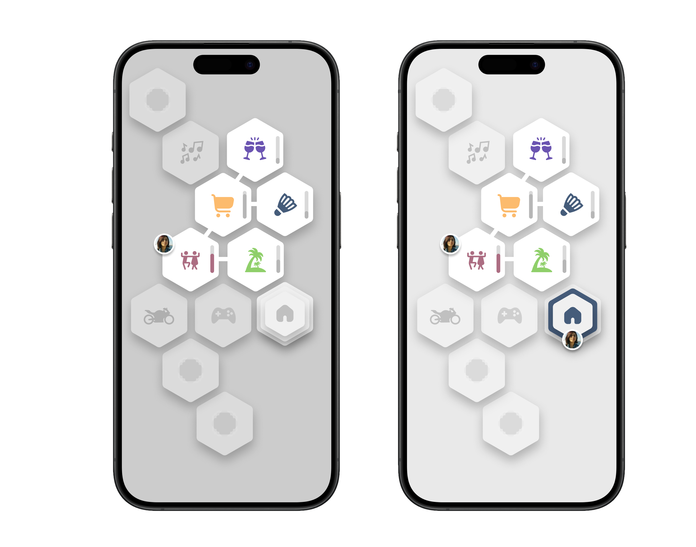

# 🌀 HexaSphereGrid

> A modular SwiftUI UI component inspired by the **Sphere Grid** from Final Fantasy X ⚔️🌟

[](https://swift.org)
[](#)
[](./LICENSE)

---

## 🌟 Overview

`HexaSphereGrid` is a highly customizable SwiftUI component that lets you build interactive evolution grids based on **hexagonal tiling** 🧩. Perfect for RPG skill trees, gamified progress maps, or just ✨cool UI experiments✨.

🧙 Inspired by Final Fantasy X's Sphere Grid, it supports:
- Interactive connected hexagonal nodes
- Smooth pinch-to-zoom and dragging
- Inertial scroll and tap interactions
- Unlockable & selectable nodes
- Customizable popovers for node content



---

## 📦 Installation

### Swift Package Manager (SPM)

Add this repository to your Xcode project:

```
https://github.com/your-name/HexaSphereGrid
```

Then import:

```swift
import HexaSphereGrid
```

---

## 🧪 Example Usage

```swift
    @StateObject private var viewModel = HexaSphereGridModel()
    
    var body: some View {
        
        
        HexaSphereGrid(viewModel: viewModel) { sphereNode in
            VStack {
                
                Text(sphereNode.name)
                    .padding()
                
                switch viewModel.sphereNodeState(forID: sphereNode.id) {
                case .unlocked:
                    
                    if viewModel.currentSelectedSphereNode?.id != sphereNode.id {
                        Button("Select") {
                            viewModel.currentSelectedSphereNode = sphereNode
                        }
                    }
                    
                case .unlockable:
                    Button("Unlock") {
                        viewModel.unlockSphereNode(withID: sphereNode.id)
                    }
                case .locked:
                    EmptyView()
                }
            }
        }
    }
```

---

## 🧱 Components

| Component             | Description                                 |
|-----------------------|---------------------------------------------|
| `SphereNode`          | Represents a single hexagonal node          |
| `HexaSphereGrid`      | The main scrollable/zoomable grid view      |
| `HexaSphereGridModel` | Handles node state and unlock logic         |
| `SphereNodeView`      | View for rendering an individual node       |

---

## 💡 Use Cases

- RPG skill trees 🔓
- Visual progress tracking 🎮
- Gamified user journeys 🧭
- Knowledge paths 📚

---

## 🔮 Roadmap

- [ ] Multi-user interactions 👥
- [ ] Dynamic node loading 🌐
- [ ] Theming & skins 🎨
- [ ] Who knows... a built-in minigame? 🎯

---

## 🧙 Inspiration

- Final Fantasy X — The Sphere Grid system
- A love for geometric UI systems 💠
- The eternal allure of hexagons ✨

---

## 👨‍💻 Author

Made with ❤️ by [Nicolas LAURENT](https://github.com/squall09s)  
If you like it, **star it and share it!**

---

## 📄 License

MIT — Use it well and build epic things 🪄
